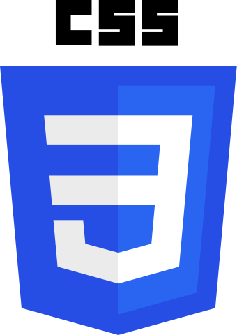
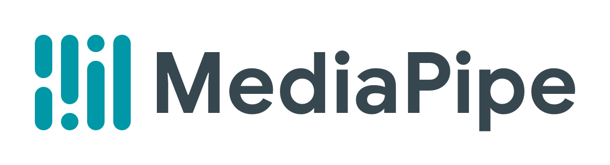
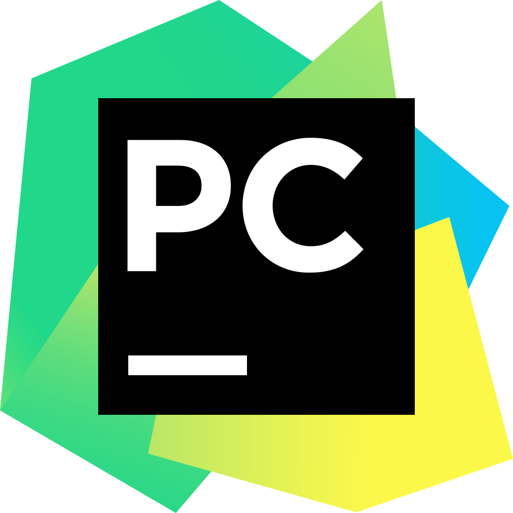
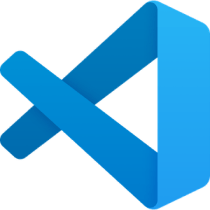

# GestoLingo

# Autores
- [Guillermo Rojo Santos](https://github.com/GuillermoRojoSantos)
- [José Antonio Díaz](https://github.com/jada1998velez)
- [Gabriel Postigo](https://github.com/GabrielPostigo)
---
# Descripción y Justificación

👋 ¡Hola!,¿Te gustatía aprender más sobre la Lengua de Signos Española? 👋

Entonces debes de conocer **GestoLingo**, la mejor APP para aprender esta lengua. 🤙

Pero, ¿qué es GestoLingo? 🤔

**GestoLingo** es una herramienta de interpretación y traducción en tiempo real del **LSE** (Lengua de Signos Española) que usa `CV` (Computer Vision) y `NLP` (Natural Language Processing) para identificar, interpretar y transformar palabras simples del LSE en palabras equivalentes en español.

El principal propósito de esta herramienta es ayudar a gente con impedimentos del habla a aprender a comunicarse mediante el uso del Lenguaje de Signos en Español. ☝

¿Cómo ha sido logrado? 😱

Gracial al grupo de estudiantes del **Máster de Inteligencia Artificial y Big Data**, logrando conseguir crear un modelo  con Inteligencia Artificial capaz de realizar esta difícil tarea 🦾🤖

# Índice

[Arquitectura del proyecto](#arquitectura-del-proyecto-1)
--
[Tecnologías utilizadas](#tecnologc3adas-utilizadas-1)
--
[Obtención de datos](#obtencic3b3n-de-datos-1)
--
[Limpieza de datos](#limpieza-de-datos-1)
--
[Exploración y visualización de los datos](#preparacic3b3n-de-los-datos-1)
--
[Preparación de los datos](#preparacic3b3n-de-los-datos-1)
--
[Entrenamiento del modelo y comprobación del rendimiento](#entrenamiento-del-modelo-y-comprobacic3b3n-del-rendimiento-1)
--
[Procesamiento de Lenguaje Natural](#procesamiento-de-lenguaje-natural-1)
--
[Aplicación Web](#aplicacic3b3n-web-1)
--
[Bibliografía](#bibliografc3ada-1)
--
[Conclusión](#conclusic3b3n-1)
--

# Arquitectura del proyecto

## Diagrama
Este proyecto recoge 2 campos fundamentales de la Inteligencia Artificial, como lo son el NLP y el Reconocimiento de Imágenes. Se ha decidido dividir el proyecto en 3 campos fundamentales: 

* **Data:** Para la recogida y procesamiento de datos
* **Modelo:** Para la realización de una red neuronal que será el cerebro de la aplicación
* **Web:** Para mostrar de forma más interactiva el resultado final.

A continuación se explicará de manera más detallada cada apartado:

**Data:**
* Se recogerán los datos para el entrenamiento con `grabaciones` realizadas por los propios participantes del proyecto para posteriormente tratarlas y exportarlas a un DataFrame.
* Se realizarán técnicas de `Web Scraping` a la página web [DILSE](https://fundacioncnse-dilse.org/) para la obtención de Videos y comprobación de palabras. Esos datos serán tratados y cargados a un Bucket de S3 el cual servirá como “Base de Datos”.

**Modelo:**

* En primer lugar, gracias a la librería `Keras`, se creará una red neuronal, la cual obtendrá datos de entrenamiento y validación. Posteriormente con la librería `TensorFlow` entrenaremos dicho modelo.

**Web:**

Se creará una aplicación web con Streamlit, la cual permanecerá en local debido a las limitaciones obtenidas por la plataforma a la hora de albergarla. La web estará dividida en las siguientes pestañas:

* **Índice:** Donde tendremos información principal sobre la página
* **Aprende:** En esta pestaña podremos aprender varias de las palabras del lenguaje de signos, gracias a que podemos buscar en el bucket de `S3` los vídeos para la demostración de éstas.
* **Practicar:** Aquí estará albergado el modelo, podremos activar la opción de “Cámara” para en tiempo real realizar algunas de las palabras que anteriormente hemos podido aprender.
* **Configuración:** Esta pestaña es necesaria para poder acceder al bucket de `AWS`, escribiendo las credenciales, diferenciando entre cuentas profesionales y corporativas

## Jerarquía de directorios

[Data](https://github.com/GuillermoRojoSantos/GestoLingo/blob/main/data): Directorio donde se almacenan los datos que se irán generando para el entrenamiento del modelo.
* [DataFrames](https://github.com/GuillermoRojoSantos/GestoLingo/blob/main/data/dataFrames):  Directorio donde se almacenan los archivos HDF5 antes de la limpieza, generados al pasar las fotos por ‘src/new_process_hands.py’.

* [model](https://github.com/GuillermoRojoSantos/GestoLingo/blob/main/data/model): Directorio donde se guarda el modelo tras ser creado por ‘src/train_model.py’ .
    * [GestoLingo.keras](https://github.com/GuillermoRojoSantos/GestoLingo/blob/main/data/model/GestoLingo.keras): Modelo entrenado.
    * [hand_landmarker.tas](https://github.com/GuillermoRojoSantos/GestoLingo/blob/main/data/model/hand_landmarker.tas): Archivo que se usará para realizar las inferencias en ‘src/new_extract_hands.py’.

* [treatedDF](https://github.com/GuillermoRojoSantos/GestoLingo/blob/main/data/treatedDF): Directorio donde se almacenan los DataFrames tras ser limpiados en el cuaderno ‘notebooks/Limpieza_y_Exploración_de_datos.ipynb’.

[words](https://github.com/GuillermoRojoSantos/GestoLingo/blob/main/words): Directorio donde se almacenan las palabras, con sus samples y frames de cada gesto obtenido por src/new_extract_hands.py.

[images](https://github.com/GuillermoRojoSantos/GestoLingo/blob/main/words): Directorio donde están las imagenes que usaremos en README.md.

[notebooks](https://github.com/GuillermoRojoSantos/GestoLingo/blob/main/notebooks): Directorio se encuentran los cuadernos Jupyter.

* [Limpieza_y_Exploración_de_datos.ipynb](https://github.com/GuillermoRojoSantos/GestoLingo/blob/main/notebooks/Limpieza_y_Exploración_de_datos.ipynb): Cuaderno Jupyter que limpia los Dataframes almacenados en ‘data/dataframes’ y los almacena en ‘data/treatedDF’

* [WebScrapingGestolingo.ipynb](https://github.com/GuillermoRojoSantos/GestoLingo/blob/main/notebooks/WebScrapingGestolingo.ipynb):  Cuaderno Jupyter donde se realiza un scrapeo al diccionario Dilse, descarga los videos y los sube a un bucket en S3.

[src](https://github.com/GuillermoRojoSantos/GestoLingo/blob/main/src): Directorio donde se almacenan los scripts principales.

* [legacy](https://github.com/GuillermoRojoSantos/GestoLingo/blob/main/src/legacy): Directorio donde quedan guardados los scripts de una versión antigua, en la que se usó un modelo de mediapipe diferente.

    * [extract_hands.py](https://github.com/GuillermoRojoSantos/GestoLingo/blob/main/src/legacy/extract_hands.py): Script de extracción de gestos y almacenado en local.

    * [process_hands.py](https://github.com/GuillermoRojoSantos/GestoLingo/blob/main/src/legacy/process_hands.py): Script para procesar y obtener los archivos HDF5 de las palabras almacenadas en el directorio words.

* [streamlit](https://github.com/GuillermoRojoSantos/GestoLingo/blob/main/src/streamlit): Directorio donde se almacenan los scripts y archivos relacionados con la aplicación web.

    * [images](https://github.com/GuillermoRojoSantos/GestoLingo/blob/main/src/streamlit/images): Directorio donde se almacenan las imágenes usadas en la web.

    * [streamlit_main.py](https://github.com/GuillermoRojoSantos/GestoLingo/blob/main/src/streamlit/streamlit_main.py): Script principal de la web.

    * [style.css](https://github.com/GuillermoRojoSantos/GestoLingo/blob/main/src/streamlit/style.css): Archivo de la hoja de estilos CSS para la web.

* [new_extract_hands.py](https://github.com/GuillermoRojoSantos/GestoLingo/blob/main/src/new_extract_hands.py): Script para capturar gestos y almacenar los frames en local, en la carpeta words.

* [new_process_hands.py](https://github.com/GuillermoRojoSantos/GestoLingo/blob/main/src/new_process_hands.py): Script que procesa los gestos almacenados en words y genera un archivo HDF5 correspondiente en la carpeta data/dataframes.

* [train_model.py](https://github.com/GuillermoRojoSantos/GestoLingo/blob/main/src/train_model.py): Script que sirve para crear, entrenar y guardar el modelo entrenado en la carpeta data/models.

# Tecnologías utilizadas

* **Open CV:** Biblioteca de visión por computadora.
* **Python:** Lenguaje de programación de alto nivel.
* **Streamlit:** Marco de creación de aplicaciones web interactivas con Python.
* **Mediapipe:** Biblioteca para análisis de datos de medios (imágenes y videos).
* **AWS:** Amazon Web Services, plataforma de servicios en la nube.
* **Google Colab:** Entorno de cuadernos colaborativos basado en la nube.
* **Jupyter:** Entorno interactivo para escribir y ejecutar código en cuadernos.
* **Miniconda:** Distribución de Conda más ligera para gestión de paquetes.
* **Tensorflow:** Biblioteca de código abierto para aprendizaje automático.
* **Keras:** Interfaz de alto nivel para redes neuronales, integrada en TensorFlow.
* **html:** Lenguaje de marcado para la creación de páginas web.
* **CSS:** Lenguaje para el diseño y estilo de páginas web.
* **Cx-Freeze:** Herramienta para crear ejecutables a partir de programas de Python.
* **Lupas Rename:** Aplicación para renombrar muchos archivos.
* **Github:** Plataforma de desarrollo colaborativo utilizando Git.
* **Git:** Sistema de control de versiones distribuido.
* **Visual Studio Code:** Editor de código fuente.
* **Pycharm:** Entorno de desarrollo integrado (IDE) para Python.

# Obtención de datos

### 1º intento
En un principio se probbó a obtener los datos de la fuente  "[**Diccionario de la Lengua de Signos Española**](https://fundacioncnse-dilse.org/)", ésta página nos ofrece un buscador en el que nosotros podremos elegir la palabra que queramos aprender y nos aparecerá un video descargable para esa palabra.

En primer lugar utilizamos técnicas de Web Scraping desde Google Colab para la obtención de esos vídeos.
Utilizaremos la librería `BeautifulSoup` y la librería `request` para la obtención de dichos datos

Cuando obtengamos los vídeos de la web, es necesario dividirlo en frames, por lo que usaremos la siguiente función para dividir el vídeo y guardar esos frames en carpetas

(***NOTA:** Vamos a usar una sola palabra como ejemplo, pero se deberá de hacer después con todas las que queramos*)

Para guardar las imágenes y no tener que repetir el proceso cada vez que iniciamos el colab, utilizamos el siguiente código

Usando el modelo de Mediapipe de detección de manos, hacemos una predicción en cada frame de la posición de las manos, para ello utilizamos el siguiente código:

Con el modelo de Mediapipe que se ha mencionado antes, se ha creado una clase con funcionalidades dedicadas al seguimiento de manos (el archivo `src/seguimiento_manos.py`), en el cuál se establecen las funciones para ubicar una sola mano o ambas, detectar la posición de de estas, cuantos dedos hay levantados y la distancia que hay entre los dedos de cada mano.

Vamos a mostrar un ejemplo de como se vería un frame de la palabra `hola` con la detección del mediapipe.

### 2º intento y con el que nos quedamos
Después de probar este método y ver que no sabiamos como implementarlo, decidimos obtener los datos de las manos directamente nosotros mismos con una aplicación en Python, el archivo `src/extract_hands.py`.
Su funcionamiento redica en que al ejecutarse, pedirá por la terminal que palabras vas a capturar, creando las carpetas correspondientes, cada vez que detecte una mano capturará. Pero, para pasar de toma habrá que pulsar la tecla `Q` del teclado. Si quieres cerrar el programa, solamente tendrás que pulsar `Esc`.

#### Extracción de Keypoints de los samples y almacenamiento en archivos HDF
Tras sacar todas las tomas que necesites de esa Palabra, se ejecutará `process_hands.py` para procesar los keypoints de cada frame almacenado en cada sample, nos generará un archivo `<palabra>.h5`, donde se almacenará el Dataframe de la palabra.

# Limpieza de datos

# Exploración y visualización de los datos

# Preparación de los datos

# Entrenamiento del modelo y comprobación del rendimiento

# Procesamiento de Lenguaje Natural

# Aplicación Web

# Bibliografía

# Conclusión