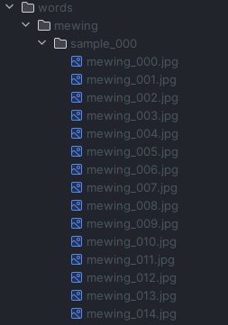
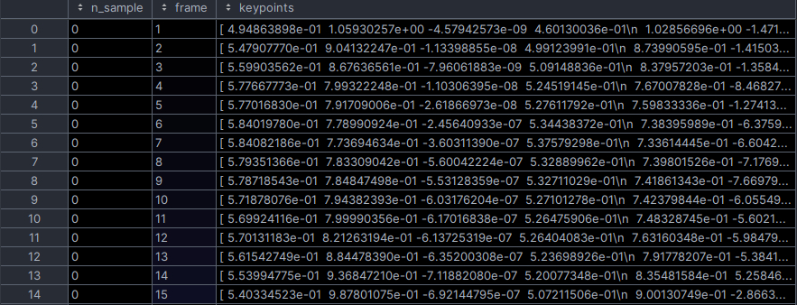
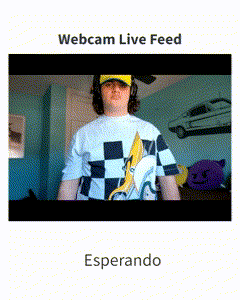
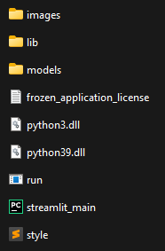

# GestoLingo


# Autores
- [Guillermo Rojo Santos](https://github.com/GuillermoRojoSantos) --> 40%
- [José Antonio Díaz](https://github.com/jada1998velez) --> 35%
- [Gabriel Postigo](https://github.com/GabrielPostigo) --> 25%
---
# Descripción y Justificación

👋 ¡Hola!,¿Te gustaría aprender más sobre la Lengua de Signos Española? 👋

Entonces debes de conocer **GestoLingo**, la mejor APP para aprender esta lengua. 🤙

Pero, ¿qué es GestoLingo? 🤔

**GestoLingo** es una herramienta de interpretación y traducción en tiempo real del **LSE** (Lengua de Signos Española) que usa `CV` (Computer Vision) y `NLP` (Natural Language Processing) para identificar, interpretar y transformar palabras simples del LSE en palabras equivalentes en español.

El principal propósito de esta herramienta es ayudar a gente con impedimentos del habla a aprender a comunicarse mediante el uso del Lenguaje de Signos en Español. ☝

¿Cómo ha sido logrado? 😱

Gracial al grupo de estudiantes del **Máster de Inteligencia Artificial y Big Data**, logrando conseguir crear un modelo  con Inteligencia Artificial capaz de realizar esta difícil tarea 🦾🤖

---
# Enlaces de descarga

[Descargar GestoLingo para Windows 10/11](https://www.swisstransfer.com/d/c5d29505-ff13-4b65-a4ae-432588e4b058)

[Descargar GestoLingo para Linux]() (en proceso)

[Descargar GestoLingo para MacOS]() (en proceso)

---

# Índice
1. [Arquitectura del proyecto](#id1)
2. [Tecnologías utilizadas](#id2)
3. [Obtención de datos](#id3)
4. [Limpieza de datos](#id4)
5. [Exploración y visualización de los datos](#id5)
6. [Preparación de los datos](#id6)
7. [Entrenamiento del modelo y comprobación del rendimiento](#id7)
8. [Procesamiento de Lenguaje Natural](#id8)
9. [Aplicación Web](#id9)
10. [Freeze de la Aplicación](#id10)
11. [Bibliografía](#id11)
12. [Conclusión](#id12)
---

<div id='id1'/>
   
# Arquitectura del proyecto

## Diagrama
Este proyecto recoge 2 campos fundamentales de la Inteligencia Artificial, como lo son el NLP y el Reconocimiento de Imágenes. Se ha decidido dividir el proyecto en 3 campos fundamentales: 

* **Data:** Para la recogida y procesamiento de datos
* **Modelo:** Para la realización de una red neuronal que será el cerebro de la aplicación
* **Aplicación:** Para mostrar de forma más interactiva el resultado final.


A continuación se explicará de manera más detallada cada apartado:

**Data:**
* Se recogerán los datos para el entrenamiento con `grabaciones` realizadas por los propios participantes del proyecto para posteriormente tratarlas y exportarlas a un DataFrame.
* Se realizarán técnicas de `Web Scraping` a la página web [DILSE](https://fundacioncnse-dilse.org/) para la obtención de Videos y comprobación de palabras. Esos datos serán tratados y cargados a un Bucket de S3 el cual servirá como “Base de Datos”.

**Modelo:**


* En primer lugar, gracias a la librería `Keras`, se creará una red neuronal, la cual obtendrá datos de entrenamiento y validación. Posteriormente con la librería `TensorFlow` entrenaremos dicho modelo.


**Web:**

Se creará una aplicación web con Streamlit, la cual permanecerá en local debido a las limitaciones obtenidas por la plataforma a la hora de albergarla. La web estará dividida en las siguientes pestañas:

* **Índice:** Donde tendremos información principal sobre la página
* **Aprende:** En esta pestaña podremos aprender varias de las palabras del lenguaje de signos, gracias a que podemos buscar en el bucket de `S3` los vídeos para la demostración de éstas.
* **Practicar:** Aquí estará albergado el modelo, podremos activar la opción de “Cámara” para en tiempo real realizar algunas de las palabras que anteriormente hemos podido aprender.
* **Configuración:** Esta pestaña es necesaria para poder acceder al bucket de `AWS`, escribiendo las credenciales, diferenciando entre cuentas profesionales y corporativas

## Jerarquía de directorios

[Data](https://github.com/GuillermoRojoSantos/GestoLingo/blob/main/data): Directorio donde se almacenan los datos que se irán generando para el entrenamiento del modelo.
* [DataFrames](https://github.com/GuillermoRojoSantos/GestoLingo/blob/main/data/dataFrames):  Directorio donde se almacenan los archivos HDF5 antes de la limpieza, generados al pasar las fotos por ‘src/new_process_hands.py’.

* [model](https://github.com/GuillermoRojoSantos/GestoLingo/blob/main/data/model): Directorio donde se guarda el modelo tras ser creado por ‘src/train_model.py’ .
    * [GestoLingo.keras](https://github.com/GuillermoRojoSantos/GestoLingo/blob/main/data/model/GestoLingo.keras): Modelo entrenado.
    * [hand_landmarker.tas](https://github.com/GuillermoRojoSantos/GestoLingo/blob/main/data/model/hand_landmarker.tas): Archivo que se usará para realizar las inferencias en ‘src/new_extract_hands.py’.

* [treatedDF](https://github.com/GuillermoRojoSantos/GestoLingo/blob/main/data/treatedDF): Directorio donde se almacenan los DataFrames tras ser limpiados en el cuaderno ‘notebooks/Limpieza_y_Exploración_de_datos.ipynb’.

[words](https://github.com/GuillermoRojoSantos/GestoLingo/blob/main/words): Directorio donde se almacenan las palabras, con sus samples y frames de cada gesto obtenido por src/new_extract_hands.py.

[images](https://github.com/GuillermoRojoSantos/GestoLingo/blob/main/words): Directorio donde están las imagenes que usaremos en README.md.

[notebooks](https://github.com/GuillermoRojoSantos/GestoLingo/blob/main/notebooks): Directorio se encuentran los cuadernos Jupyter.

* [Limpieza_y_Exploración_de_datos.ipynb](https://github.com/GuillermoRojoSantos/GestoLingo/blob/main/notebooks/Limpieza_y_Exploración_de_datos.ipynb): Cuaderno Jupyter que limpia los Dataframes almacenados en ‘data/dataframes’ y los almacena en ‘data/treatedDF’

* [WebScrapingGestolingo.ipynb](https://github.com/GuillermoRojoSantos/GestoLingo/blob/main/notebooks/WebScrapingGestolingo.ipynb):  Cuaderno Jupyter donde se realiza un scrapeo al diccionario Dilse, descarga los videos y los sube a un bucket en S3.

[src](https://github.com/GuillermoRojoSantos/GestoLingo/blob/main/src): Directorio donde se almacenan los scripts principales.

* [legacy](https://github.com/GuillermoRojoSantos/GestoLingo/blob/main/src/legacy): Directorio donde quedan guardados los scripts de una versión antigua, en la que se usó un modelo de mediapipe diferente.

    * [extract_hands.py](https://github.com/GuillermoRojoSantos/GestoLingo/blob/main/src/legacy/extract_hands.py): Script de extracción de gestos y almacenado en local.

    * [process_hands.py](https://github.com/GuillermoRojoSantos/GestoLingo/blob/main/src/legacy/process_hands.py): Script para procesar y obtener los archivos HDF5 de las palabras almacenadas en el directorio words.


* [streamlit](https://github.com/GuillermoRojoSantos/GestoLingo/blob/main/src/streamlit): Directorio donde se almacenan los scripts y archivos relacionados con la aplicación web.

    * [images](https://github.com/GuillermoRojoSantos/GestoLingo/blob/main/src/streamlit/images): Directorio donde se almacenan las imágenes usadas en la web.

    * [streamlit_main.py](https://github.com/GuillermoRojoSantos/GestoLingo/blob/main/src/streamlit/streamlit_main.py): Script principal de la web.

    * [style.css](https://github.com/GuillermoRojoSantos/GestoLingo/blob/main/src/streamlit/style.css): Archivo de la hoja de estilos CSS para la web.

    * [run.py](https://github.com/GuillermoRojoSantos/GestoLingo/blob/main/src/streamlit/run.py): ejecutable de la aplicación

    * [setup.py](https://github.com/GuillermoRojoSantos/GestoLingo/blob/main/src/streamlit/setup.py): Script que se utiliza para crear el ejecutable de la aplicación

* [new_extract_hands.py](https://github.com/GuillermoRojoSantos/GestoLingo/blob/main/src/new_extract_hands.py): Script para capturar gestos y almacenar los frames en local, en la carpeta words.

* [new_process_hands.py](https://github.com/GuillermoRojoSantos/GestoLingo/blob/main/src/new_process_hands.py): Script que procesa los gestos almacenados en words y genera un archivo HDF5 correspondiente en la carpeta data/dataframes.

* [train_model.py](https://github.com/GuillermoRojoSantos/GestoLingo/blob/main/src/train_model.py): Script que sirve para crear, entrenar y guardar el modelo entrenado en la carpeta data/models.

<div id='id2'/>
   
# Tecnologías utilizadas

<div>
    
    
    
    
    
    
    
    
    
    
    
    
    
    
    
    
</div>

* **Open CV:** Biblioteca de visión por computadora.
* **Python:** Lenguaje de programación de alto nivel.
* **Streamlit:** Marco de creación de aplicaciones web interactivas con Python.
* **Mediapipe:** Biblioteca para análisis de datos de medios (imágenes y videos).
* **AWS:** Amazon Web Services, plataforma de servicios en la nube.
* **Google Colab:** Entorno de cuadernos colaborativos basado en la nube.
* **Jupyter:** Entorno interactivo para escribir y ejecutar código en cuadernos.
* **Miniconda:** Distribución de Conda más ligera para gestión de paquetes.
* **Tensorflow:** Biblioteca de código abierto para aprendizaje automático.
* **Keras:** Interfaz de alto nivel para redes neuronales, integrada en TensorFlow.
* **html:** Lenguaje de marcado para la creación de páginas web.
* **CSS:** Lenguaje para el diseño y estilo de páginas web.
* **Cx-Freeze:** Herramienta para crear ejecutables a partir de programas de Python.
* **Lupas Rename:** Aplicación para renombrar muchos archivos.
* **Github:** Plataforma de desarrollo colaborativo utilizando Git.
* **Git:** Sistema de control de versiones distribuido.
* **Visual Studio Code:** Editor de código fuente.
* **Pycharm:** Entorno de desarrollo integrado (IDE) para Python.


<div id='id3'/>
   
# Obtención de datos
### Dentro de `src/new_extract_hands.py`
Mediante el uso del script `src/new_extract_hands.py` se obtienen los frames, separados por samples, de cada palabra.

Importación de librerias
```py
import mediapipe as mp
from mediapipe.framework.formats import landmark_pb2
from mediapipe.python import solutions
import cv2
import os
import re
```
Se importa la clase de `HandLandmarker`, gracias a la cuál se realiza la detección y seguimiento de las manos
```py
HandLandmarker = mp.tasks.vision.HandLandmarker
```
Se configuran las opciones base para el modelo(`baseOptions`), proporcionando la ruta del archivo que se usará para realizar las inferencias
```py
baseOptions = mp.tasks.BaseOptions(model_asset_path='../data/model/hand_landmarker.task')
```
Con la variable de `hloptions` se configuran las opciones especificas para el mdoelo, las cuales incluyen:
- El modo de funcionamiento
- El número máximo de manos a detectar
- Las confianzas mínimas para la detección y seguimiento de manos
```py
hloptions = mp.tasks.vision.HandLandmarkerOptions(
    base_options=baseOptions,
    running_mode=mp.tasks.vision.RunningMode.IMAGE,
    num_hands=2,
    min_hand_detection_confidence=0.3, 
    min_hand_presence_confidence=0.1,  
    min_tracking_confidence=0.3,  
)
```
Se crea un contador de imagenes, `ima_cont=0` que será usado más adelante y una variable que contiene el molde para los nombres de las samples, `sample_var='sample_00'`

Se establece el nombre de la palabra a grabar con un `input()`, pidiendonos el nombre por consola y se crea la ruta donde se almacenará las samples de la palabra grabada
```py
word = input('Ingrese la palabra a aprender: ')
folder = f"../data/words/{word}/"
```

Se comprueba la existencia de diversas carpetas, en caso de que alguna no exista, se creará.
```py
if not os.path.exists("../data/"):
    os.mkdir("../data/")
if not os.path.exists("../data/words/"):
    os.mkdir("../data/words/")

if not os.path.exists(folder):
    print('Carpeta creada ', folder)
    os.makedirs(folder)
```

A continuación se almacena en la variable `dirs` un listado de que hay en directorio `folder`, en caso de no haber nada se establece `toma_cont` a 0. Si hay contenido ya, se toma el último número de sample que haya, y le suma uno para que no se machaque.
```py
dirs = os.listdir(folder)
if len(dirs) > 0:
    toma_cont = int(re.findall("\d+",dirs[-1])[0])+1
else:
    toma_cont = 0
```

Inicialización del objeto de captura de video
```py
cap = cv2.VideoCapture(0)
```
Configuración de la resolución del objeto de captura
```py
cap.set(3,1280)
cap.set(4,720)
```

Aquí empieza el bucle principal para captar las manos y guardar los frames, este bucle se termina cuando pulses la tecla 'Esc' de tu teclado.

Se lee el fotograma de video actual(`frame`), el cuál luego se pasa a formato RGB para que Mediapipe pueda trabajar con él, se crea un objeto para representar el frame, `mp_image`, y se usa el método `detect_for_video` para detectar y seguir las manos del frame.

Se recorren las manos detectadas, dibujandoles los landmarks. 
```py
hand_landmarks_proto = landmark_pb2.NormalizedLandmarkList()
hand_landmarks_proto.landmark.extend([
landmark_pb2.NormalizedLandmark(x=landmark.x, y=landmark.y, z=landmark.z) for landmark in hand_landmarks
])
solutions.drawing_utils.draw_landmarks(
    frame_c,
    hand_landmarks_proto,
    solutions.hands.HAND_CONNECTIONS,
    solutions.drawing_styles.get_default_hand_landmarks_style(),
    solutions.drawing_styles.get_default_hand_connections_style())
```

Tras lo cuál, se almacenan los frames en los cuales se hayan detectado manos en ellos en el directorio. En función del contador `ima_cont`, se irá modificando la numeración de la imagen guardada.
```py
            if ima_cont < 10:
                cv2.imwrite(f"{folder}/{sample_var}{toma_cont}/{word}_00{ima_cont}.jpg",
                            cv2.cvtColor(frame, cv2.COLOR_BGR2RGB))
            elif ima_cont < 100:
                cv2.imwrite(f"{folder}/{sample_var}{toma_cont}/{word}_0{ima_cont}.jpg",
                            cv2.cvtColor(frame, cv2.COLOR_BGR2RGB))
            else:
                cv2.imwrite(f"{folder}/{sample_var}{toma_cont}/{word}_{ima_cont}.jpg",
                            cv2.cvtColor(frame, cv2.COLOR_BGR2RGB))
            ima_cont += 1
            print(ima_cont)
```

      


Como se controla la numeración de los samples
```py
elif ima_cont >=10:
            toma_cont += 1
            if toma_cont == 10:
                sample_var = "sample_0"
            elif toma_cont == 100:
                sample_var = "sample_"
            print("me he sumado")
            print(toma_cont)
            ima_cont = 0
```

Se muestra el frame procesado actual en una ventana llamada 'Gestolingo' mediante el siguiente código
```py
cv2.imshow('GestoLingo', cv2.cvtColor(frame_c,cv2.COLOR_RGB2BGR))

Si se pulsa la tecla 'Esc' mientras se ejecuta el script, se cierra la aplicación y termina el bucle
```py
if cv2.waitKey(5) == 27:
            break
```
Al terminar el bucle, se libera el objeto de captura de video `cap` y se cierran todas las ventanas
```py
cap.release()
cv2.destroyAllWindows()
```

---

### Bucle completo:
```py
with HandLandmarker.create_from_options(hloptions) as landmarker:
    while True:
        _,frame = cap.read()
        frame = cv2.cvtColor(frame,cv2.COLOR_BGR2RGB)
        mp_image = mp.Image(image_format=mp.ImageFormat.SRGB, data=frame)
        timestamp = cap.get(cv2.CAP_PROP_POS_MSEC) if cap.get(cv2.CAP_PROP_POS_MSEC) is not None else 0
        result = landmarker.detect_for_video(mp_image,int(timestamp))
        frame_c = frame.copy()

        hand_landmarks_list = result.hand_landmarks
        handedness_list = result.handedness
        if result.hand_landmarks:
            if not os.path.exists(f"{folder}/{sample_var}{toma_cont}/"):
                os.mkdir(f"{folder}/{sample_var}{toma_cont}/")
                print(f" Carpeta {folder}/{sample_var}{toma_cont}/ creada")
        # Loop through the detected hands to visualize.
            for idx in range(len(hand_landmarks_list)):
                hand_landmarks = hand_landmarks_list[idx]
                handedness = handedness_list[idx]

                # Draw the hand landmarks.
                hand_landmarks_proto = landmark_pb2.NormalizedLandmarkList()
                hand_landmarks_proto.landmark.extend([
                    landmark_pb2.NormalizedLandmark(x=landmark.x, y=landmark.y, z=landmark.z) for landmark in hand_landmarks
                ])
                solutions.drawing_utils.draw_landmarks(
                    frame_c,
                    hand_landmarks_proto,
                    solutions.hands.HAND_CONNECTIONS,
                    solutions.drawing_styles.get_default_hand_landmarks_style(),
                    solutions.drawing_styles.get_default_hand_connections_style())

            if ima_cont < 10:
                cv2.imwrite(f"{folder}/{sample_var}{toma_cont}/{word}_00{ima_cont}.jpg",
                            cv2.cvtColor(frame, cv2.COLOR_BGR2RGB))
            elif ima_cont < 100:
                cv2.imwrite(f"{folder}/{sample_var}{toma_cont}/{word}_0{ima_cont}.jpg",
                            cv2.cvtColor(frame, cv2.COLOR_BGR2RGB))
            else:
                cv2.imwrite(f"{folder}/{sample_var}{toma_cont}/{word}_{ima_cont}.jpg",
                            cv2.cvtColor(frame, cv2.COLOR_BGR2RGB))
            ima_cont += 1
            print(ima_cont)

        elif ima_cont >=10:
            toma_cont += 1
            if toma_cont == 10:
                sample_var = "sample_0"
            elif toma_cont == 100:
                sample_var = "sample_"
            print("me he sumado")
            print(toma_cont)
            ima_cont = 0

        cv2.imshow('GestoLingo', cv2.cvtColor(frame_c,cv2.COLOR_RGB2BGR))
        if cv2.waitKey(5) == 27:
            break

```
      


---

### Dentro de `WebScrapingGestolingo.ipynb`

Se instalan los paquetes necesarios
```py
!pip install unidecode
!pip install boto3
```
Se importan las librerias que vamos a usar
```py
from bs4 import BeautifulSoup
import requests as re
import boto3
from unidecode import unidecode
import matplotlib.pyplot as plt
import pandas as pd
```

Mediante el siguiente array de palabras
```py
palabras = ["Padre", "Madre", "Hijo","Hija", "Abuelo", "Abuela", "Hermano", "Hermana","Lunes", "Martes", "Miércoles", "Jueves", "Viernes", "Sábado", "Domingo",
"Cabeza", "Brazo", "Pierna", "Mano", "Pie", "Ojo", "Nariz", "Boca","Mundo", "Ordenador", "Traducir", "Inteligencia", "Hola", "Camisa", "Pantalón", "Vestido", "Zapato", "Sombrero", "Calcetín", "Chaqueta",
"Pan", "Fruta", "Verdura", "Carne", "Arroz", "Leche", "Agua", "Postre", "Rojo", "Azul", "Amarillo", "Verde", "Blanco", "Negro", "Marrón", "Gris",
"Desayunar", "Almorzar", "Cenar", "Dormir", "Trabajar", "Estudiar", "Jugar", "Feliz", "Triste", "Enojado", "Sorprendido", "Asustado", "Contento",
"Ordenador", "Software", "Hardware", "Archivo", "Programa", "Pantalla", "Teclado", "Ratón", "Internet", "Usuario", "amar", "beber", "caminar", "cantar", "comer", "correr", "decidir", "escribir", "estudiar", "hablar",
"jugar", "leer", "mirar", "nadar", "pensar", "saltar", "trabajar", "viajar", "vivir", "aprender","asistir", "cambiar", "cocinar", "construir", "contribuir","descansar", "desear", "encontrar", "escuchar",
"explicar", "ganar", "gritar", "inventar", "llorar", "mentir","olvidar", "opinar", "participar", "permitir", "perder", "preferir", "recibir", "recordar", "sonreír", "terminar", "tocar", "tratar", "utilizar", "visitar"]
```

Le realizamos una función para limpiar los acentos y poner todas las palabras en minusculas:
```py
def limpiar_palabra(palabra):
    palabra_limpia = unidecode(palabra.lower())
    return palabra_limpia

palabras_limpias = [limpiar_palabra(palabra) for palabra in palabras]
print(palabras_limpias)
```

Guardamos las credenciales de AWS, para su posterior uso
```py
aws_id = 'xxxxxxxxxxxxxxxx'
aws_key = 'xxxxxxxxxxxxxxxxxxx'
aws_token = 'xxxxxxxxxxxxxxxxxx'
region = 'us-east-1'
```
Se realiza la petición de las palabras del array, para ver si están dentro de la página de Dilse. Después, se separan las que hay y las que no están.
```py
palabras_no_encontradas = []
palabras_encontradas = []
requisito = "No se ha encontrado ningún resultado para el término buscado."

for palabra in palabras_limpias:
    url2 = f"https://fundacioncnse-dilse.org/?buscar={palabra}"
    headers = {
        'User-Agent': 'Mozilla/5.0 (Windows NT 10.0; Win64; x64) AppleWebKit/537.36 (KHTML, like Gecko) Chrome/121.0.0.0 Safari/537.36'}
    response = re.get(url2, headers=headers)
    soup = BeautifulSoup(response.text, 'html.parser')
    if soup.find_all("h2")[1].text == requisito:
        palabras_no_encontradas.append(palabra)
    else:
        palabras_encontradas.append(palabra)
```
Tras esta separación, se muestra un gráfico para mostrar cuantas han sido encontradas y cuantas no
```py
fig, ax = plt.subplots()
bars = plt.bar(['Encontradas', 'No encontradas'], [len(palabras_encontradas), len(palabras_no_encontradas)])

plt.xlabel('Estado de las palabras')
plt.ylabel('Número de palabras')
plt.title('Comparación de palabras encontradas y no encontradas')

for bar in bars:
    yval = bar.get_height()
    plt.text(bar.get_x() + bar.get_width() / 2, yval, round(yval, 2), ha='center', va='bottom')

plt.show()
```

Tras esto, se establece conexión con S3 para subir los videos de cada palabra en nuestro Bucket de AWS S3 
```py
s3 = boto3.client('s3', aws_access_key_id=aws_id, aws_secret_access_key=aws_key,aws_session_token=aws_token,region_name=region)
```

Hacemos peticiones para cada palabra, para poder descargar cada video de cada palabra y subirlo al bucked de S3
```py
for palabra in palabras_encontradas:
  # Definimos las URL de descarga y el nombre del archivo
  url = f"https://fundacioncnse-dilse.org/bddilse/images/stories/{palabra}.mov"
  nombre_archivo = f"{palabra}.mov"
  headers = {
      'User-Agent': 'Mozilla/5.0 (Windows NT 10.0; Win64; x64) AppleWebKit/537.36 (KHTML, like Gecko) Chrome/121.0.0.0 Safari/537.36'}

  respuesta = re.get(url,headers=headers)
  response.text
  soup = BeautifulSoup(response.text,'html.parser')
  respuesta.raise_for_status()

  with open(nombre_archivo, 'wb') as archivo:
      archivo.write(respuesta.content)
  s3.put_object(Body=respuesta.content, Bucket="gestolingo", Key=nombre_archivo)
  print(f"Descarga exitosa: {nombre_archivo}")
```

Se exporta a S3 un CSV con todas las palabras que se han guardado (se usará en la web)
```py
df = pd.DataFrame({'Palabras': palabras_encontradas})
df.to_csv('palabras_encontradas.csv', index=False)

nombre_archivo_local = 'palabras_encontradas.csv'
bucket_name = 'gestolingo'
nombre_archivo_s3 = 'palabras_encontradas.csv'

s3.upload_file(nombre_archivo_local, bucket_name, nombre_archivo_s3)
```


<div id='id4'/>
   
# Limpieza de datos
   ### Dentro de `WebScrapingGestolingo.ipynb`
   Debido a que muchas de las palabras de la lengua española no tienen una traducción definida es necesario limpiar de las palabras propuestas todas aquellas que no se encuentren dentro del diccionario de lenguaje de signos
   ```py
   palabras_no_encontradas = []
   palabras_encontradas = []
   requisito = "No se ha encontrado ningún resultado para el término buscado."

   for palabra in palabras_limpias:
       url2 = f"https://fundacioncnse-dilse.org/?buscar={palabra}"
       headers = {
           'User-Agent': 'Mozilla/5.0 (Windows NT 10.0; Win64; x64) AppleWebKit/537.36 (KHTML, like Gecko) Chrome/121.0.0.0 Safari/537.36'}
       response = re.get(url2, headers=headers)
       soup = BeautifulSoup(response.text, 'html.parser')
       if soup.find_all("h2")[1].text == requisito:
           palabras_no_encontradas.append(palabra)
       else:
           palabras_encontradas.append(palabra)


      # Crear un gráfico de barras
      fig, ax = plt.subplots()
      bars = plt.bar(['Encontradas', 'No encontradas'], [len(palabras_encontradas), len(palabras_no_encontradas)])
      
      # Agregar etiquetas y título
      plt.xlabel('Estado de las palabras')
      plt.ylabel('Número de palabras')
      plt.title('Comparación de palabras encontradas y no encontradas')
      
      # Mostrar el número encima de cada barra
      for bar in bars:
          yval = bar.get_height()
          plt.text(bar.get_x() + bar.get_width() / 2, yval, round(yval, 2), ha='center', va='bottom')
      
      # Mostrar el gráfico
      plt.show()
   ```
      

   Tras esta separación entre encontradas y no encontradas, las no encontradas no son más usadas.

   ### Dentro de `Limpieza_y_Exploración_de_Datos.ipynb`

   Tras visualizar el estado de las palabras almacenadas en DataFrames, se limitan los samples a tener um máximo de 60 frames por sample, eliminando aquellos samples que superen esa cifra de frames.

   ```py
   for ind, x in enumerate(ls):
    for num in x.n_sample.unique():
        indices = x[x.n_sample==num].index
        if x.loc[indices[-1],"frame"]>60:
            x.drop(indices,inplace=True)
   ```
   
<div id='id5'/>
   
# Exploración y visualización de los datos
### Dentro de `notebooks\Limpieza_y_Exploración_de_datos.ipynb`
Tras cargar los dataframes sin limpiar, se muestra el estado de cada dataset
```py
ls = [rojo,hola,mundo,ordenador]
ls_name=["rojo","hola","mundo","ordenador"]
hold = []
hold_max = [] 
hold_min = []
for index,x in enumerate(ls):
    print(f"Media de frames en el dataset {ls_name[index]}: ",x.groupby("n_sample").frame.count().mean())
    hold_min.append(x.groupby("n_sample").frame.count().min())
    hold.append(x.groupby("n_sample").frame.count().mean())
    hold_max.append(x.groupby("n_sample").frame.count().max())
    print(f"Forma del dataset {ls_name[index]}: ",x.shape)
    print(f"Número de samples en el dataset {ls_name[index]}: ",len(x.n_sample.unique()))
    print()
hold = np.array(hold)
print("Media de frames de todas las muestras: ",hold.mean())
```
Y tras esto, se muestra por gráficas con el sample con menos frames de cada dataset, la media de frames por samples en cada dataframe, el sample con más frames dentro de cada dataframes
```py
fig,axs = plt.subplots(1,3,figsize=(30,5))
axs[0].bar(["Rojo","Hola","Mundo","Ordenador"],hold_min)
axs[1].bar(["Rojo","Hola","Mundo","Ordenador"],hold)
axs[2].bar(["Rojo","Hola","Mundo","Ordenador"],hold_max)

axs[0].set_title("Min Frames")
axs[1].set_title("Mean Frames")
axs[2].set_title("Max Frames")

plt.bar([x for x in range(len(hold))],hold)
plt.show()
```


### Dentro de `notebooks\Entrenamiento.ipynb`
Se entrena un nuevo modelo, y se muestra una gráfica con la que podremos apreciar la evolución de la pérdida y la validación de la perdida durante el proceso del entrenamiento:


Y más adelante, se muestra una matriz de confusión para ver cuán bien entrenado está este nuevo modelo, viendo en la diagonal central los aciertos.


<div id='id6'/>
   
# Preparación de los datos 
### Dentro de `src/new_process_hands.py`

La importación de las librerias
```py
import mediapipe as mp
import cv2
import os
import re
import pandas as pd
import numpy as np
```

Se importa la clase de `HandLandmarker`, gracias a la cuál se realiza la detección y seguimiento de las manos
```py
HandLandmarker = mp.tasks.vision.HandLandmarker
```

Se configuran las opciones base para el modelo(`baseOptions`), proporcionando la ruta del archivo que se usará para realizar las inferencias
```py
baseOptions = mp.tasks.BaseOptions(model_asset_path='../data/model/hand_landmarker.task')
```

Con la variable de `hloptions` se configuran las opciones especificas para el mdoelo, las cuales incluyen:
- El modo de funcionamiento
- El número máximo de manos a detectar
- Las confianzas mínimas para la detección y seguimiento de manos
```py
hloptions = mp.tasks.vision.HandLandmarkerOptions(
    base_options=baseOptions,
    running_mode=mp.tasks.vision.RunningMode.IMAGE,
    num_hands=2,
    min_hand_detection_confidence=0.3, 
    min_hand_presence_confidence=0.1,  
    min_tracking_confidence=0.3,  
)
```
Se confirma que exista el directorio, de no existir, se crea
```py
if not os.path.exists("../data/dataFrames/"):
    os.mkdir("../data/dataFrames/")
```

Para la creación del archivo HDF5 correspondienta a la palabra que esté siendo procesada, se realiza un bucle en el cuál:
- Se itera sobre los directorios dentro de `data/works`, donde cada directorio corresponde a una palabra guardada
- Se crea un DataFrame vacío con las columnas para el número de la sample, `n_sample`, el numero del fotograma, `frame`, y los keypoints de las manos, `keypoints`.
```py
df = pd.DataFrame(columns=["n_sample", "frame", "keypoints"])
```
- Se itera sobre los samples dentro del directorio de cada palabra, cada sample contiene los frames del gesto.
- Se lee cada imagen, se pasa a RGB y se convierte en un objeto, `mb_image`. Mediante el modelo de detección de manos, `landmarker.detect()`, se encuentran los keypoints que serán almacenados en el `df`, junto a su número de la sample y el número del frame correspondiente.
- Una vez procesados todos los frames del directorio de la palabra, el `df` se guarda en un archivo HDF5 mediante `df.to_hdf()`, cada archivo HDF5 se nombre con el nombre de la palabra.
```py
with HandLandmarker.create_from_options(hloptions) as landmarker:
    for lista in os.listdir("../data/words/"):
        df = pd.DataFrame(columns=["n_sample", "frame", "keypoints"])
        for sample in os.listdir(f"../data/words/{lista}/"):
            f_counter = 1
            for image in os.listdir(f"../data/words/{lista}/{sample}/"):
                frame = cv2.imread(f"../data/words/{lista}/{sample}/{image}")
                frame = cv2.cvtColor(frame, cv2.COLOR_BGR2RGB)
                frame = mp.Image(image_format=mp.ImageFormat.SRGB, data=frame)
                result = landmarker.detect(frame)
                left_hand = []
                right_hand = []

                hand_landmarks_list = result.hand_landmarks
                handedness_list = result.handedness
                if hand_landmarks_list:
                    for x in range(len(handedness_list)):
                        if handedness_list[x][0].display_name == "Right":
                            # Mano Derecha
                            right_hand = np.array([[x.x, x.y, x.z] for x in hand_landmarks_list[x]]).flatten()
                        elif handedness_list[x][0].display_name == "Left":
                            # Mano izquierda
                            left_hand = np.array([[x.x, x.y, x.z] for x in hand_landmarks_list[x]]).flatten()
                    if len(left_hand) == 0:
                        left_hand = np.zeros(21 * 3)
                    elif len(right_hand) == 0:
                        right_hand = np.zeros((21 * 3))
                    res_hand_landmarks = np.concatenate([left_hand, right_hand])
                    df.loc[len(df.index)] = {"n_sample": int(re.findall("\d+", sample)[0]),
                                             "frame": f_counter,
                                             "keypoints": res_hand_landmarks}
                    f_counter += 1
            f_counter = 0

        df.to_hdf(f"../data/dataFrames/{lista}.h5", key="data", mode="w")
```
Así es como se verá el dataframe almacenado en el archivo HDF5
    

<div id='id7'/>
   
# Entrenamiento del modelo y comprobación del rendimiento 
### Dentro de `src/train_model.py`
Se realizan las importaciones:
```py
import os
import numpy as np
import pandas as pd
from tensorflow import keras
from tensorflow.keras.utils import pad_sequences, to_categorical
from tensorflow.keras import layers, callbacks
import matplotlib.pyplot as plt
from sklearn.model_selection import train_test_split
```
Se establece cuantas palabras hay, la cantidad máxima de frames por sample y se crean dos listas vacias una para almacenar los keypoints y otra para almacenar las etiquetas, respectivamente 
```py
words = [x for x in os.listdir("../data/treatedDF")]
max_frames = 30
word_keypoints = []  # Keypoint sequence for each sample
word_nums = []  # Words represented by numbers
```

Se empeiza a procesar los datos, por cada Dataframe, se itera sobre el número de muestras y sus etiquetas, mediante la función `pad_sequences` de Keras
```py
for num, word in enumerate(words):
    df = pd.read_hdf(f"../data/treatedDF/{word}")
    for num_sample in df.n_sample.unique():
        word_keypoints.append([data["keypoints"] for _, data in df[df.n_sample == num_sample].iterrows()])
        word_nums.append(num)
```

Se rellena y truncan las secuencias de keypoints de una longitud de max frames. 

Separación de datos en conjuntos de entrenamiento y prueba. Y preparación de etiquetas, donde las etiquetas de las palabras pasan a ser vectores one-hot mediante el uso del método ‘to_categorical’.

```py
word_keypoints = pad_sequences(word_keypoints, maxlen=30, padding="post", truncating="post", dtype='float32')

X_train, X_test, y_train, y_test = train_test_split(word_keypoints, word_nums, test_size=0.30)
X_train = np.array(X_train)
y_train = to_categorical(y_train, num_classes=4, dtype="int")
X_test = np.array(X_test)
y_test = to_categorical(y_test, num_classes=4, dtype="int")

```

Se define un callback que será el encargado de detener el entrenamiento del modelo si no hay mejoras en la pérdida durante un número específico de epochs
```py
early_stoping = callbacks.EarlyStopping(min_delta=0.001,
                                        patience=5,
                                        restore_best_weights=True,
                                        monitor="loss")
```

Definimos el modelo, mediante `keras.Sequential`
Se agregan capas LSTM con diferentes configuraciones. 
También se agregan capas de Batch Normalización, Dense(las cuales están completamente conectadas) y Dropout para regularizar el modelo y evitar el sobreajuste.
La compilación del modelo es mediante el optimizador Adam, la función de pérdida de ‘categorical_crossentropy’ y la métrica de ‘accuracy’

```py
model = keras.Sequential(
    [layers.LSTM(64, return_sequences=True, activation="tanh", input_shape=(30, 126)),
     layers.LSTM(128, return_sequences=True, activation="tanh"),
     layers.LSTM(128, return_sequences=False, activation="tanh"),
     layers.BatchNormalization(),
     layers.Dense(70, activation="sigmoid"),
     layers.Dropout(0.2),
     layers.Dense(70, activation="relu"),
     layers.Dense(70, activation="relu"),
     layers.Dropout(0.2),
     layers.Dense(70, activation="relu"),
     layers.Dense(70, activation="relu"),
     layers.Dropout(0.2),
     layers.Dense(64, activation="relu"),
     layers.Dense(64, activation="relu"),
     layers.BatchNormalization(),
     layers.Dropout(0.2),
     layers.Dense(32, activation="sigmoid"),
     layers.Dense(32, activation="relu"),
     layers.Dense(4, activation="softmax")]
)
model.compile(optimizer="adam", loss="categorical_crossentropy", metrics=["accuracy"])

```

El entrenamiento del modelo se realiza mediante el uso del método ‘fit’ de Keras.
Se le proporcionan los datos de entrenamiento, X_train e y_train, y los datos de validación, X_test e y_test. Se establece un número de epochs en 100 y se le proporciona el callback establecido antes.

```py
history = model.fit(X_train,
                    y_train,
                    epochs=100,
                    validation_data=(X_test, y_test),
                    callbacks=[early_stoping])
```

Se creará un Dataframe donde se almacenará todo sobre el entrenamiento del modelo, su pérdida y la validación de cada epoch
```py
history_df = pd.DataFrame(history.history)
```

Se visualiza esos valores de perdida, validación mediante Matplotlib, a lo largo del entrenamiento.

```py
history_df.loc[:, ['loss', 'val_loss']].plot()
plt.show()
```

Se muestra por pantalla un resumen del modelo

```py
print(model.summary())
```

Antes de guardar el modelo entrenado, se comprueba que la ruta exista, de no hacerlo, se crea.
Después, se guarda el modelo

```py
if not os.path.exists("../data/model/"):
    os.mkdir("../data/model/")

model.save("../data/model/GestoLingo.keras")
```

<div id='id8'/>
   
# Procesamiento de Lenguaje Natural

El **NLP** *"Natural Language Processing"* en éste proyecto es el factor principal del mismo ya que es esencial para lograr una comunicación efectiva entre personas que utilizan este medio de expresión y aquellas que no lo entienden.

* **Detección de Gestos y Signos:** En esta etapa, la aplicación emplea algoritmos de **Computer Vision** para identificar y comprender los gestos y signos realizados, dando inicio al proceso de interpretación del lenguaje de signos.

* **Traducción Automática:** Una vez detectados los gestos, el sistema realiza una traducción automática, convirtiendo la información visual en texto.

* **Generación de Respuestas:** Basándose en el análisis contextual, la aplicación utiliza un modelo de generación de lenguaje para ofrecer respuestas coherentes y contextualmente relevantes, dandp la posibilidad de ofrecer comunicación bidireccional y mejorar la experiencia del usuario.

* **Flexibilidad y Adaptabilidad:** La aplicación demuestra su capacidad de adaptarse a diversos estilos y velocidades de expresión en el lenguaje de signos, garantizando una experiencia fluida dependiendo de los usuarios que la usen.

      


<div id='id9'/>
   
# Aplicación Web 
### dentro de `src/streamlit/streamlit_main.py`
Importación de las librerias
```py
import cv2
import streamlit as st
import mediapipe as mp
import base64
import boto3
import pandas as pd
from io import StringIO
from io import BytesIO
from tensorflow import keras
import numpy as np
import os
```
Se establece una configuración general de la página
```py
st.set_page_config(
    page_title="Gestolingo",
    layout="wide",
    page_icon="🤖",
    initial_sidebar_state = "expanded"
)
```
Se cargan las diferentes imagenes y se transfomran en una cadena base64, mediante `base64.b64encode()`
```py
# Logo
with open("./images/logo1.png", "rb") as f:
    contents = f.read()
    data_url = base64.b64encode(contents).decode("utf-8")

# Imagen Inicio
with open("./images/SBG-TEC.png", "rb") as f:
    contents2 = f.read()
    data_url2 = base64.b64encode(contents2).decode("utf-8")

# Logo AWS
with open("./images/aws.png", "rb") as f:
    contents3 = f.read()
    data_url3 = base64.b64encode(contents3).decode("utf-8")

# Robot
with open("./images/buenas.gif", "rb") as f:
    contents4 = f.read()
    data_url4 = base64.b64encode(contents4).decode("utf-8")
```
Se establece un header
```py
header = f'''
    <header>
        <div id="logo-container">
            
        </div>
        <div id="app-name">Gestolingo</div>
    </header>
'''
```
El código que genera una cadena de texto HTML para la pestaña índice
```py
body = f'''
<div class= "index-div">
    <div class="text-block">
        <h2>La IA que da voz al silencio</h2>
        <p>Imaginen un mundo donde la barrera del lenguaje no sea un obstáculo, donde la comunicación sea fluida para todos, independientemente de su habilidad auditiva. Esto es exactamente lo que la nueva IA, desarrollada por los alumnos del Máster de IA & Big Data quieren lograr.</p>
        <h2>Cómo funciona</h2>
        <p>Esta innovadora IA utiliza avanzados algoritmos de visión en tiempo real para interpretar los gestos y signos realizados por personas que se comunican a través del lenguaje de signos. Esta IA puede traducir estos gestos en tiempo real.</p>
        <ul>
            <li> En la pestaña <b>Aprender</b> de nuestra Web podrás empezar con un diccionario de vídeos explicativos a aprender tus primeras palabras con el Lenguaje de Signos. </li>
            <li> En el apartado <b>Practicar</b> puedes poner a prueba tus habilidades sobre lo aprendido gracias al sistema de IA implementado en tiempo Real. Recuerda tener tu cámara lista y, ¡A gesticular se ha dicho!. </li>
            <li> Inicie sesión en <b>Configuración</b> con su cuenta de AWS para poder empezar a aprender </li>
        </ul>
    </div>
    <div class="image-block">
        
    </div>
</div>
'''
```

El código para la parte donde se muestra el logo de AWS dentro de la pestaña 'Configuración'
```py
configLogo = f'''
        <div class="logo-aws">
            
        </div>
        <h3>Configuración del servidor AWS</h3>
        <li> ¡Disponible para cuentas corporativas! </li>
        <li> Accede a nuestra base de datos aportando las credenciales de AWS </li>
        <li> No olvides confirmar los datos antes de abandonar esta pestaña </li>
'''
```
El código para el bocadillo que se mostrará, en la pestaña 'Aprender', en caso de que no se haya iniciado conexión con el S3
```py
bocadillo = f'''
<div class="centrado">
    <div>
        <div class="bocadillo-redondo">
            <section class="texto-bocadillo">  
                <p class="texto-animado"> Vaya a <b>"Configuración"</b> </p>
            </section>
        </div>
        
    </div>
</div>
'''
```
El código para el footer, que se mostrará en todas las pestañas
```py
footer = f'''
    <br>
    <br>
    <br>
    <footer>
        &copy; 2024 Gestolingo - Traductor de Lenguaje de Signos
    </footer>
'''
```
Menos el footer, todos estos codigos tienen una imagen que se carga desde una URL de datos base64, generada anteriormente.

Se carga el documento CSS, gracias a `st.markdown` se inserta el contenido del CSS en Streamlit. Enlace al [CSS](https://github.com/GuillermoRojoSantos/GestoLingo/blob/main/src/streamlit/style.css) 
Gracias a la opción de `unsafe_allow_html=True` se permite que se renderice el contenido HTML dentro de la app de forma segura.
```py
with open('./style.css') as css:
    st.markdown(f"<style>{css.read()}</style>", unsafe_allow_html = True)
```
Se muestra el header en todas las pestañas llamando a ‘st.markdown’ para que muestre el contenido HTML de la variable ‘header’.
```py
st.markdown(header, unsafe_allow_html=True)
```
Ahora veremos el código de verificación de inicio de sesión con AWS, verificando que ciertas claves estén presentes en el estado de la sesión de Streamlit. 
Si alguna falla/falta, se establece su valor a ‘False’. Se usan para controlar el estado de configuración de AWS
```py
state = st.session_state

if 'aws_id' not in st.session_state:
    state["aws_id"] = False
if 'aws_key' not in st.session_state:
    state["aws_key"] = False
if 'aws_token' not in st.session_state:
    state["aws_token"] = False
if 'open_key' not in st.session_state:
    state["open_key"] = False

```
Mediante `st.tabs` se crean 4 pestañas que permiten al usuario moverse entre diferentes secciones de la app. 
Las instancias de cada pestaña se almacenan en las variables tab1,tab2,tab3 y tab4, 'Inicio','Aprender','Practicar' y 'Configuración', respectivamente.
```py
tab1, tab2, tab3, tab4 = st.tabs(["Inicio", "Aprender", "Practicar","Configuración"])
```
Primero que nada, empecemos poniendo el footer, puesto que tiene que aparecer en todas las pestañas.
Por eso hay que ponerlo antes de establecer ninguna pestaña
```py
st.markdown(footer, unsafe_allow_html=True)
```

Ahora, empezamos a hacer las pestañas. Una a una.
Empecemos con la primera, la de inicio.
Al ser solo texto y una foto, código que se expusó antes(variable `body`), no tiene mucha complicación.
```py
with tab1:
  st.markdown(body, unsafe_allow_html=True)
```

La siguiente pestaña a realizar es 'Aprender'
En esta pestaña se mostrará un contenido u otro en función de si se ha establecido conexión o no con AWS. Para ello usaremos un condicional para verificar que `state["open_key"]=True`.

En caso de ser `True`, se mostrará un campo de texto donde podrás escribir una palabra, esta se buscará en la lista que hay y, de estar en ella, verás que aparece un video donde podrás ver el gesto de esa palabra.
Al introducir una palabra que no esté en la lista, te saldrá un error avisando de que esa palabra no está disponible.
Si tuvieras dudas con respecto a que palabra puedes o no encontrar, habrá un botón abajo donde ponga 'Mostrar Diccionario'. Al darle, veremos un DataFrame que nos muestra todas las palabras disponibles.

En caso de ser `False`, Se mostrara un bocadillo, la variable `bocadillo` antes vista, que nos indicará que debemos ir a la pestaña de 'Configuración' para poder ingresar las credenciales necesarias para establecer conexión con AWS.

```
with tab2:
    if state["open_key"]:
        # Configurar la conexión a S3
        if state["aws_token"] is not None:
            s3 = boto3.client('s3', aws_access_key_id=state["aws_id"], aws_secret_access_key=state["aws_key"],
                              aws_session_token=state["aws_token"])
        else:
            s3 = boto3.client('s3', aws_access_key_id=state["aws_id"], aws_secret_access_key=state["aws_key"])
        busqueda = st.text_input("Buscar la palabra que quieras aprender:")
        col1, col2,col3,col4,col5 = st.columns(5)

        with col1:
            st.text("")

        with col2:
            st.header("La palabra elegida es:")
            st.subheader(busqueda)
        with col3:
                st.text("")
        with col4:

            bucket_name = 'gestolingo'
            video_key = f'{busqueda}.mov'
            if busqueda:
            # Obtener el objeto desde S3
                try:
                    response = s3.head_object(Bucket=bucket_name, Key=video_key)
                    if response:
                        response2 = s3.get_object(Bucket=bucket_name, Key=video_key)
                        # Obtener los datos del video
                        video_data = response2['Body'].read()

                        # Mostrar el video desde los datos obtenidos de S3
                        st.video(BytesIO(video_data))
                    else:
                        st.alert("La palabra introducida no se encuentra en nuestra Base de Datos", icon="🚨")
                    
                except s3.exceptions.ClientError as e:
                    if e.response['Error']['Code'] == '404':
                        st.header(f"La palabra {busqueda} no se encuentra en nuestra base de datos.")
                    else:
                        st.header(f"Error al verificar la existencia del objeto: {e}")
                except Exception as e:
                    st.header(f"Se ha perdido la conexión")
            
        with col5:
            st.text("")
        mostrar = st.button("Mostrar Diccionario")
        if mostrar:
            # Descargar el archivo CSV desde S3
            response = s3.get_object(Bucket=bucket_name, Key='palabras_encontradas.csv')
            content = response['Body'].read().decode('utf-8')

            # Crear el DataFrame a partir del contenido del archivo
            palabras = pd.read_csv(StringIO(content))
            # Dividir la columna 'Palabras' en 16 columnas
            num_columnas = 16
            columnas_divididas = pd.DataFrame(palabras['Palabras'].to_numpy().reshape(-1, num_columnas),
                                            columns=[f'Columna_{i+1}' for i in range(num_columnas)])
            st.title('Palabras Disponibles')
            st.dataframe(columnas_divididas)  
    else:
        st.markdown(bocadillo, unsafe_allow_html=True)

```
Pasemos a la pestaña 3, 'Practicar'
En la cual, verás un botón que te dice 'Comenzar', si le das, se abrira tu cámara, mediante `cap = cv2.VideoCapture(0)`
Se crea un espacio de visualización  para los frames, mediante `st.empty()`
Se carga el modelo (entrenado previamente con `src/train_model.py`), con `model:keras.Sequential = keras.models.load_model("../../data/model/GestoLingo.keras")`
Se inicia un bucle `while` que va capturando frames del video en vivo y procesa la detección de las manos. Este bucle finalizará al pulsar el botón 'Stop'
Por cada frame se hace una serie de pasos:
   - Se convierte a RGB y se procesa con `Mediapipe Hands` para detectar las manos.
   - Se dibujan las landmarks
   - Se procesan las coordenadas de los landmarks para dictaminar que mano se está captando, si la derecha o la izquierda.
   - Se almacenan los keypoints de la mano detectada en una lista
   - Se verifica si se ha detectado una mano y si hay suficientes keypoints almacenados. Si se cumplen ambas, se incrementa el contador de frames y se realiza una predicción.
   - Dicha predicción se muestra en un objeto de Streamlit llamado `hold_meter_result.write()`
   - La imagen del frame procesado se muestra en el espacio de visualización creado usando `frame_placeholder.image`
```py
with tab3:
    abrir = st.button("Comenzar")
    if abrir:
        
        st.title("Webcam Live Feed")

        cap = cv2.VideoCapture(0)

        frame_placeholder = st.empty()
        stop_button_pressed = st.button("stop")
        mp_drawing = mp.solutions.drawing_utils
        mp_drawing_styles = mp.solutions.drawing_styles
        model:keras.Sequential = keras.models.load_model("../../data/model/GestoLingo.keras")

        keypoints = []
        frame_count = 0
        words = [x[0:-11] for x in os.listdir("../../data/treatedDF/")]
        model_prediction_idx = None
        hold_model_result = st.empty()
        hold_model_result.write("Esperando")
        with mp.solutions.hands.Hands(
                # Parametro para especificar la complejidad del modelo usado en la detección de las manos
                model_complexity=1,
                min_detection_confidence=0.5,
                min_tracking_confidence=0.6
        ) as mp_hands:
            while True:
                _, frame = cap.read()
                frame = cv2.cvtColor(frame, cv2.COLOR_BGR2RGB)
                results = mp_hands.process(frame)
                image = cv2.cvtColor(frame, cv2.COLOR_RGB2BGR)
                left_hand = []
                right_hand = []
                if results.multi_hand_landmarks:
                    for hand_landmarks in results.multi_hand_landmarks:
                        mp_drawing.draw_landmarks(
                            image,
                            hand_landmarks,
                            mp.solutions.hands.HAND_CONNECTIONS,
                            mp_drawing_styles.get_default_hand_landmarks_style(),
                            mp_drawing_styles.get_default_hand_connections_style()
                        )
                        wrist_x = hand_landmarks.landmark[0].x
                        # Comparar la coordenada x de la muñeca con un valor arbitrario para distinguir izquierda y derecha

                        if wrist_x > 0.5:
                            left_hand = np.array([[res.x, res.y, res.z] for res in hand_landmarks.landmark]).flatten()
                        else:
                            right_hand = np.array([[res.x, res.y, res.z] for res in hand_landmarks.landmark]).flatten()

                if len(left_hand) == 0:
                    left_hand = np.zeros(21 * 3)
                if len(right_hand) == 0:
                    right_hand = np.zeros((21 * 3))
                keypoints.append(np.concatenate([left_hand, right_hand]))

                # Check if we have enough data in keypoints (len>60) and of there's a hand detected
                if len(keypoints) > 30 and (np.all(left_hand!=0) or np.all(right_hand!=0)):
                    frame_count+=1
                else:
                    # check if we have enough frames
                    if frame_count >=10:
                        # Take the last 60 keypoint record
                        # Keypoint is a 1 dim array like (,60) and we need (at least) (1,60)
                        model_prediction = model.predict(np.expand_dims(keypoints[-30:],axis=0))
                        model_prediction_idx = np.argmax(model_prediction)
                        print(words[model_prediction_idx])
                        hold_model_result.write(words[model_prediction_idx])
                        frame_count=0
                        keypoints=[]
                        print("keypoints",len(keypoints))
                frame_placeholder.image(cv2.cvtColor(image, cv2.COLOR_BGR2RGB), channels="RGB")
                if stop_button_pressed:
                    break
```
Y por último, pero no menos importante, pasamos a la pestaña 4, 'Configuración'
Aquí nos dividimos en dos columnas lo que veremos lo siguiente,
En la columna 1:
- Hay un interruptor toggle, que indicará quieres o no ingresar con una cuenta de estudiante. Esto hará que aparezca un campo extra para introducir la credencial de token su usas una cuenta de estudiante o no aparezca.
- Al introducir las credenciales correspondientes, pulsaremos el botón de 'Guardar', cuando esto suceda, se intentará verificar las credenciales, si son correctas, se modificará el estado de sesión, `state["open_key"]`.
- Se intentará establecer conexión con AWS S3, si es exitosa, devuelve `state["open_key"]=True`, se mostrará un mesaje de exito, se guardan las credenciales y que el usuario confirme pulsando un nuevo botón.
- En caso de fallar algo, saldrá un mensaje de error.

En la columna 2 se muestra el logo de AWS que establecimos antes en la variable `configLogo`
```py
with tab4:

    col1, col2 = st.columns(2)
    with col1:
        aws_token = ""
        estudiante = st.toggle("Cuenta de estudiante")
        aws_id = st.text_input("Introduce el aws_access_key_id: ")
        aws_key =st.text_input("Introduce el aws_secret_access_key: ")
        if estudiante:
            aws_token =st.text_input("Introduce el aws_session_token: ")

        guardar = st.button("Guardar")
        if guardar:
                try:
                    if aws_id and aws_key:
                        if aws_id:
                            # Eliminamos el valor del estado de sesion
                            del state["aws_id"]
                            # Le aplicamos a este estado el valor del id introducido
                            state["aws_id"] = aws_id
                        if aws_key:
                            # Eliminamos el valor del estado de sesion
                            del state["aws_key"]
                            # Le aplicamos a este estado el valor del id introducido
                            state["aws_key"] = aws_key
                        if aws_token:
                            # Eliminamos el valor del estado de sesion
                            del state["aws_token"]
                            # Le aplicamos a este estado el valor del id introducido
                            state["aws_token"] = aws_token
                        
                        try:
                            if state["aws_token"] is not None:
                                s3 = boto3.client('s3', aws_access_key_id=state["aws_id"],
                                                  aws_secret_access_key=state["aws_key"],
                                                  aws_session_token=state["aws_token"])
                            else:
                                s3 = boto3.client('s3', aws_access_key_id=state["aws_id"],
                                                  aws_secret_access_key=state["aws_key"])
                            s3.head_object(Bucket='gestolingo', Key='hola.mov')
                            state["open_key"] = True
                            st.text("Los datos han sido guardados, pulse para confirmar")
                            st.button("Confirmar")                  
                        except:
                            st.error("Error de Conexión", icon="🚨")
                except:
                    st.error("Las credenciales no son correctas", icon="🚨")
    with col2:
        st.markdown(configLogo, unsafe_allow_html=True)
```

<div id='id10'/>

# Freeze de la Aplicación

Una vez acabada la aplicación web en su totalidad, estuvimos explorando varias formas de encapsular la aplicación en un 
archivo binario para cada OS mayormente utilizado (**Windows, Linux, MacOS**).

Trás varios intentos con multiples librerías, nos decantamos por cx-freeze, una herramienta que nos permite encapsular 
un script de python junto con los archivos que necesite para su ejecución (en nuestro caso, el **modelo** y las 
**imagenes** de nuestra web). Lo que nos hizo escoger esta librería es la facilidad de la encapsulación. Para ello 
necesitaremos dos archivos a demás del script de nuestra web:
- **setup.py**: Script con la configuración de nuestro binario
- **run.py**: Script de python cuyo código se transformará en nuestro binario

A continuación ponemos un ejemplo de cada uno:
### run.py:
````python
import sys
import streamlit.web.cli as stcli

def streamlit_run():
    sys.argv = ["streamlit", "run", "streamlit_main.py", "--global.developmentMode=false"]
    sys.exit(stcli.main())


if __name__ == "__main__":
    streamlit_run()
````
La estructura de setup.py es muy simple. En nuetsro caso, solo consta de una instrucción que se pasará por consola para 
aprovechar el comando run de la librería de Streamlit en python y ejecutar el código de nuestra web.

### setup.py:
````python
from cx_Freeze import setup,Executable


setup(
    name="GestoLingo",
    version="1.0",
    description="GestoLingo",
    executables = [Executable("run.py",base=None)],
    options={
        "build_exe":{
            "include_files":["streamlit_main.py","./images/","./models/","style.css"],
            "packages":["streamlit","cv2","mediapipe","tensorflow","boto3","numpy","base64","io","os"]
        }
    }
)
````
Setup.py es más complejo. Para congelar la aplicación (el proceso de generar un binario con cx-freeze) se puede hacer 
por consola o bien con un script como setup.py, ya que este no deja de ser las mismas instrucciones del comando build 
de cx-freeze en un script que tendremos que ejecutar con dicho comando.

En el código podemos destacar dos valores:
- **description**: En este valor ponemos que archivo queremos que se convierta en el ejecutable.
- **options**: Podemos pasarle una gran variedad de valores, pero nosotros nos centramos en 2:
  - *include_files*: Un array con todos los archivos y directorios que queramos añadir al ejecutable para que este pueda
  acceder a dichos archivos 
  - *packages*: Un array con todas las librerías necesarias para la aplicación.

Otra de las cosas buenas de cx-freeze es la capacidad que tiene de manejar las librerías. Al especificarle nosotros un 
array de dependencias, cx-freeze recorrerá en cascada todas las librerías, cogiendo a demás las que tenemos en nuestro 
entorno en vez de descargarlas de canales como pip o conda con lo que si hemos tenido que modificarlas (como es en 
nuestro caso) nos ayuda a que nuestra aplicación funcione con menos problemas en distintas máquinas y con distintos OS.

Una vez hecho estos dos archivos simplemente tendremos que ejecutar el comando ``python.exe setup.py build`` y nos 
generará un ejecutable para el OS en el que hayamos ejecutado el comando.

Al acabar de ejecutar, nos quedaría la siguiente carpeta:
<div style="display: flex; justify-content: center">
  
</div>

Como podemos ver nos quedan las carpetas que hemos añadido, además de lib dónde se guardarán las librerías empaquetadas,
los archivos con la configuración de nuestro entorno virtual y por último, los archivos de nuestra aplicación.


<div id='id11'/>

# Bibliografía
- [Hand landmarks detection guide for Python](https://developers.google.com/mediapipe/solutions/vision/hand_landmarker/python#video)
- [Mediapipe - GitHub](https://github.com/google/mediapipe/blob/master/docs/solutions/hands.md)
- [Diccionario Dilse](https://fundacioncnse-dilse.org/index.php)
- [Anaconda - Docs](https://docs.anaconda.com/free/miniconda/index.html)
- [OpenCV - Docs](https://docs.opencv.org/4.x/)
- [Python - Docs](https://www.python.org/doc/)
- [Streamlit - Docs](https://docs.streamlit.io/)
- [Amazon AWS - Docs](https://docs.aws.amazon.com/)
- [Jupyter - Docs](https://docs.jupyter.org/en/latest/)
- [Tensorflow](https://www.tensorflow.org/?hl=es)
- [Keras - Docs](https://keras.io/)
- [Cx-Freeze](https://cx-freeze.readthedocs.io/en/stable/)
- [GitHub - Docs](https://docs.github.com/en)
- [Git - Docs](https://git-scm.com/doc)

<div id='id12'/>

# Conclusión

Este proyecto ha sido una gran experiencia, en la que tuvimos que pasar por muchas dificultades, las cuales 
parecian que nos haría abandonar el proyecto, pero gracias al esfuerzo, constancia y sobre todo aCtitud,
ha hecho posible que podamos realizar un modelo ejemplo de lo que podría ser la revolución en el lenguaje
de signos.

El proyecto no solo se ha afrontado como un "Trabajo de Fin de Máster" sino como un proyecto a futuro, en el
que nos gustaría continuar trabajando a pesar de la obligatoriedad del mismo.

La falta de tiempo para la realización de éste ha conllevado a la poca cantidad de palabras posibles de
traducir, ya que se requiere de mucho tiempo para ello, además del amplio desarrollo del proyecto y sobre 
todo la labor de investigación y aprendizaje que ha requerido.

En definitiva, este trabajo ha despertado en nosotros la pasión por el desarrollo de Inteligencia Artificial 
y nos ha hecho darnos cuenta de la gran ayuda que podríamos ofrecer al mundo en base a nuestro conocimiento.


> *“ La IA que da Voz al silencio “  - Gestolingo*
